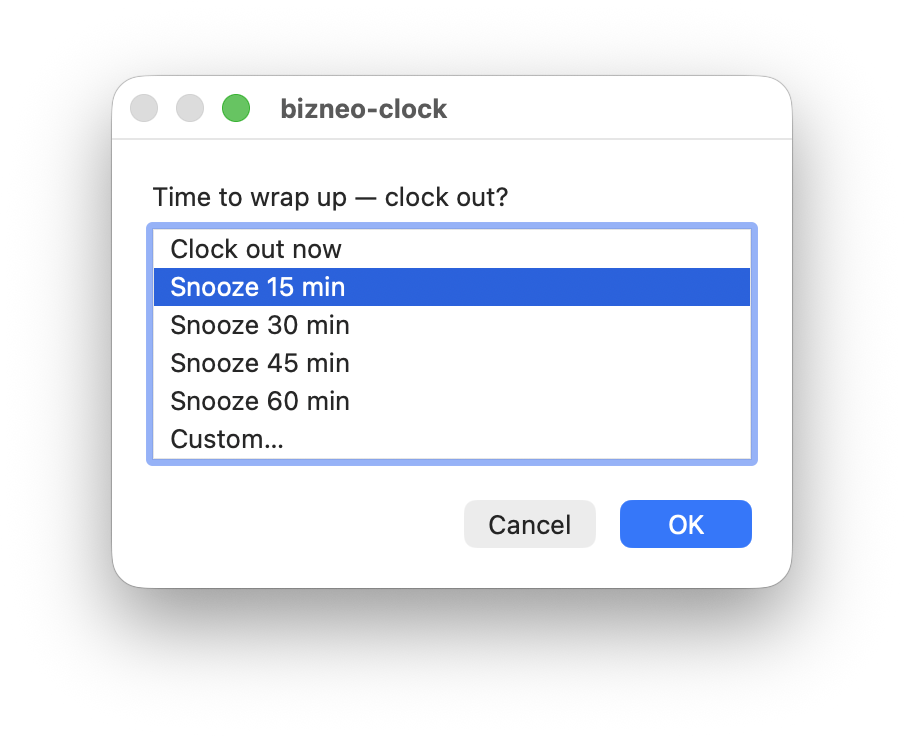

# macOS clock-in / clock-out reminders

A local `launchd` agent that nudges you to clock in when you start work, reminds you to
clock out in the evening (with snooze), and force-clocks-out late at night. Native macOS
dialogs, driven by [`bizneo-clock`](../../README.md). **Not part of the npm package** — it
lives here for version control and easy reinstall.

## Requirements

- macOS, with `bizneo-clock` installed globally (`npm i -g bizneo-clock`) and logged in
  (`bizneo-clock login`).

## Install

```bash
bash extras/macos/install.sh
```

That resolves your `bizneo-clock` path, writes `~/Library/LaunchAgents/com.jdvivar.bizneo-clock.watcher.plist`,
and loads it. The watcher runs at login, after wake, and every 5 minutes — but does nothing
unless a nudge is actually due (weekdays only).

## What it does (weekdays)

| When | Behavior |
| --- | --- |
| **07:00–11:00**, if clocked out | Dialog: **Clock in** / Snooze 15m / Skip today |
| **From 17:30**, if working or paused | Dialog: **Clock out now** / Snooze 15·30·45·60 min / Custom… |
| **21:00**, if still working or paused | Auto clock-out + a dialog and a notification |

<p align="center">
  
</p>

It reads your real state via `bizneo-clock status --json`, so it never nudges against what
you've already done. Snoozes survive sleep (they're stored as timestamps, re-checked on wake).
If you're not logged in, it shows one reminder per day instead of nagging.

### Working late

The 21:00 auto clock-out is a safety net for a session you *forgot*. It only applies to a
session that started before 21:00. If you clock in at or after 21:00 (or after midnight),
the watcher treats it as deliberate late work: no reminders, and the auto clock-out moves to
**02:00** (`LATE_AUTO_CLOCKOUT`). The start time comes from Bizneo's timer, which resets
when you resume from a break, so a break that spans 21:00 counts as late work too.

Auto clock-out also covers a break you forgot: it resumes first, then clocks out. It re-reads
your state afterwards and tells you if it didn't go through. It shows a dialog as well as a
notification because Focus modes hold back notifications; dialogs still appear. The day
filter (`ACTIVE_DAYS`) uses the day the session started, so a late Friday session is still
closed at 02:00 on Saturday.

Every action the watcher takes (auto clock-out, clock-in/out from a dialog, failures) is
logged to `~/.config/bizneo-clock/reminders/watcher.log`.

## Test it now

```bash
bash extras/macos/test.sh
```

Pops a harmless test notification + dialog **via the agent**, so you can approve the macOS
Automation/Notification permission on the spot. No clock action is taken.

## Configure

Everything is declarative in one file: [`config.sh`](./config.sh) — agent label, tick
interval, active days, the five times (24h `HHMM`), and the snooze presets. Time, day, and
snooze changes are picked up on the next tick; changing `LABEL` or `TICK_SECONDS` needs a
re-run of `install.sh`.

## Uninstall

```bash
bash extras/macos/uninstall.sh
```

## Troubleshooting

- **Nothing happens:** check the log at `~/.config/bizneo-clock/reminders/watcher.log`, and
  `launchctl print gui/$UID/com.jdvivar.bizneo-clock.watcher`.
- **No dialogs:** the first run may need Notifications/Automation permission for the agent;
  approve the macOS prompt the first time it fires.
- **Moved the repo:** re-run `install.sh` so the agent points at the new path.
